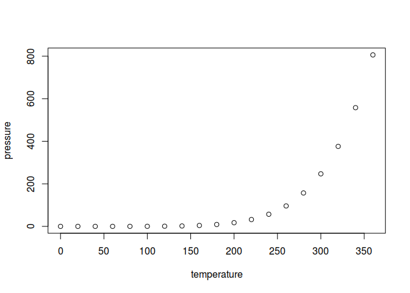

<!-- README.md is generated from README.Rmd. Please edit that file -->

# rmdplugr

<!-- badges: start -->

[](https://cran.r-project.org/package=rmdplugr)
[](https://codecov.io/gh/jolars/rmdplugr?branch=master)
[](https://travis-ci.com/jolars/rmdplugr)
[](https://ci.appveyor.com/project/jolars/rmdplugr)
<!-- badges: end -->

The goal of rmdplugr is to do

## Installation

You can install the development version from
[GitHub](https://github.com/) with:

``` r
# install.packages("devtools")
devtools::install_github("jolars/rmdplugr")
```

## Example

This is a basic example which shows you how to solve a common problem:

``` r
library(rmdplugr)
## basic example code
```

What is special about using `README.Rmd` instead of just `README.md`?
You can include R chunks like so:

``` r
summary(cars)
#>      speed           dist       
#>  Min.   : 4.0   Min.   :  2.00  
#>  1st Qu.:12.0   1st Qu.: 26.00  
#>  Median :15.0   Median : 36.00  
#>  Mean   :15.4   Mean   : 42.98  
#>  3rd Qu.:19.0   3rd Qu.: 56.00  
#>  Max.   :25.0   Max.   :120.00
```

You’ll still need to render `README.Rmd` regularly, to keep `README.md`
up-to-date.

You can also embed plots, for example:



In that case, don’t forget to commit and push the resulting figure
files, so they display on GitHub\!
